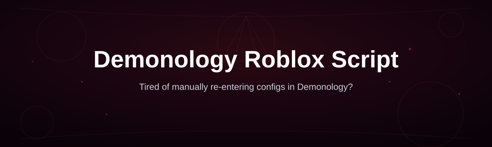
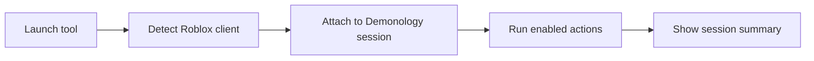

# demonology-script-hub

*A calmer way for Demonology players to run a single script tool without hunting through forum threads.*

## What this is

demonology-script-hub is a documentation and distribution page for a Demonology Roblox Script — a standalone tool built for the Demonology game on Roblox. It started as a personal notes file: a friend and I kept losing track of which build actually worked with the current Roblox patch, so we put together a single page that always points to the current version instead of a scattered pile of links.

This repository is not the script's source code and not a general Roblox modding framework. It is the reference point: what the tool does inside Demonology, what it needs to run, and where the current build lives. If you are looking for a general-purpose Roblox executor or an unrelated automation suite, this is the wrong page — this one is scoped specifically to the Demonology script and its landing page.

  

The button above opens the project's landing page, where the current build is available for download.

## Who it is for

- Demonology players who want faster grinding runs without manually repeating the same in-game actions.
- Players returning to Demonology after a break who need a quick refresher on setup rather than reading old forum posts.
- Roblox users comparing several Demonology-related tools and wanting a plain description of what one actually does.
- People who prefer a Windows-native, standalone tool over browser extensions or unclear third-party sites.
- Anyone who found a broken or outdated link elsewhere and is looking for the maintained version.

## What you can do

- **Automate repetitive farming loops** so you don't have to manually repeat the same in-game sequence.
- **Track basic run stats** during a session, useful for judging whether a grind route is worth continuing.
- **Adjust timing between actions** to match your connection and avoid desyncs during longer sessions.
- **Toggle individual features on or off** instead of running one fixed, all-or-nothing mode.
- **Reconnect after a Roblox client restart** without having to redo initial setup steps.
- **Run alongside the standard Roblox client** with no separate account or browser plugin required.
- **Check for the current build** from the landing page instead of relying on cached download links.
- **Review setup notes in one place** rather than piecing together instructions from multiple sources.

## Getting started

1. Open the landing page using the download button above.
2. Confirm the build listed matches the current Demonology game version before downloading.
3. Download the file to a folder you can find again (avoid Downloads folders that auto-clear).
4. Run the executable and let it detect your Roblox installation.
5. Launch Demonology, then enable the features you want from the tool's panel.

## Requirements

- Windows 10 or Windows 11 (64-bit).
- A working Roblox installation with Demonology already installed.
- No build tools, package managers, or command-line setup — the tool runs as a standalone executable.
- A stable internet connection for the initial download and for in-game verification.

## How it works

1. The tool launches and checks for a running Roblox client.
2. It locates the Demonology game session once you join.
3. It reads the game state needed to perform the actions you've enabled.
4. It executes those actions on a timing loop you can adjust.
5. It reports basic session info so you can see what happened while it ran.

## FAQ

**Is there a Demonology Roblox Script that still works after recent updates?**
Compatibility depends on the current Roblox patch and the Demonology game version. The landing page lists which build corresponds to which game version — check that before downloading.

**Do I need Roblox Studio or any developer tools to use this?**
No. This is a standalone Windows executable meant for players, not a development toolchain. You only need the regular Roblox client and Demonology installed.

**Why did the tool stop responding after a Roblox update?**
Roblox updates can change internal game structures the tool relies on. When this happens, wait for an updated build on the landing page rather than continuing to use the old one.

**Can I run this alongside other Roblox tools?**
Running multiple third-party tools at once increases the chance of conflicts or crashes. It's safer to run one at a time and confirm it works before adding another.

**Is this specific to Demonology, or does it work with other Roblox games?**
It's built specifically around Demonology's mechanics. It is not intended as a general Roblox automation tool for other games.

## Troubleshooting

- **Tool won't detect Roblox:** Make sure Roblox is fully launched and you've joined Demonology before starting the tool, not before.
- **Actions run but nothing happens in-game:** The game may have updated since your build was released — check the landing page for a newer version.
- **Windows flags the download:** This is common for unsigned standalone executables; verify you downloaded from the linked landing page rather than a mirror.
- **Tool closes immediately after opening:** Confirm you're on Windows 10/11 64-bit and that no conflicting overlay software (like certain recording tools) is running.

## License

This project is distributed under the [MIT License](LICENSE). It is provided as-is, without warranty, and use of any third-party tool with Roblox is at your own discretion and risk.

  

